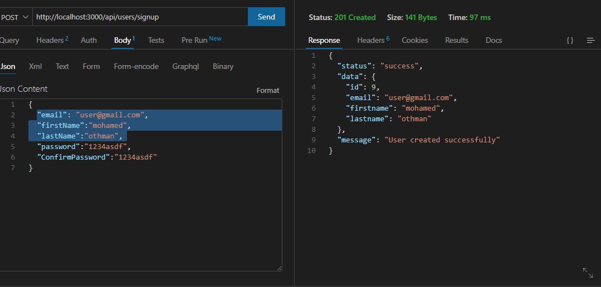
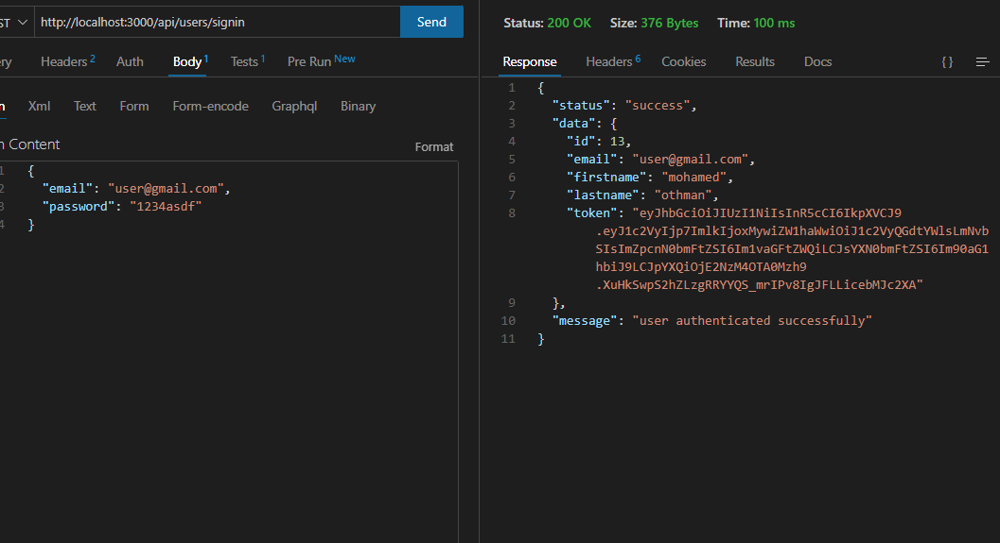
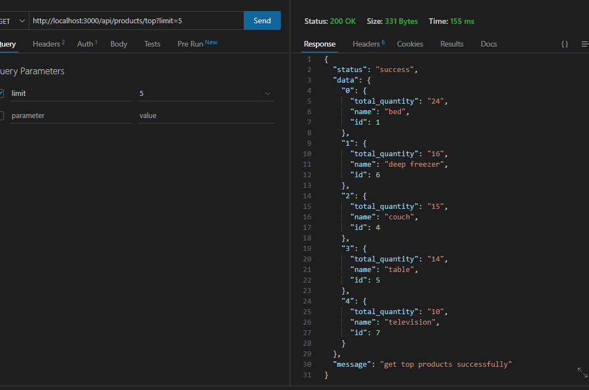
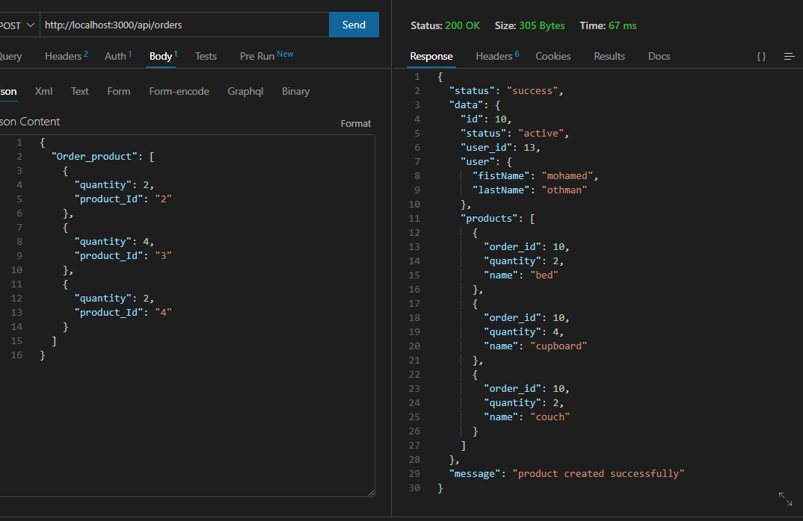
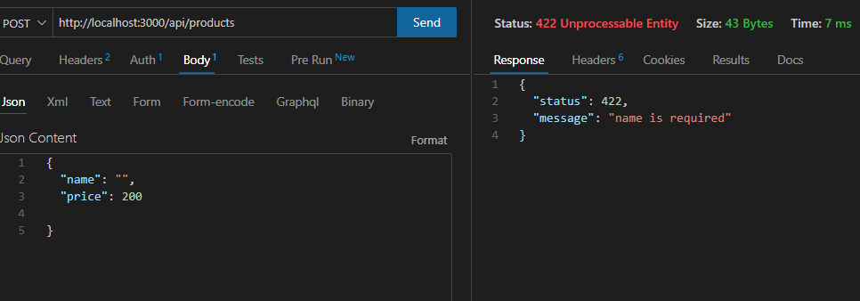
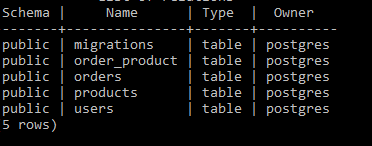
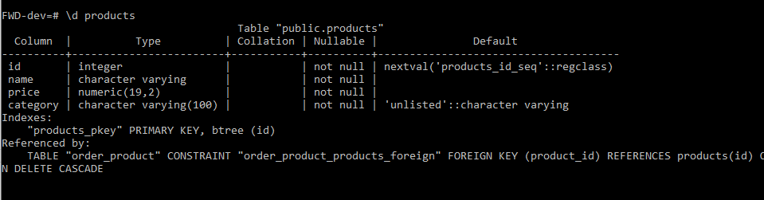
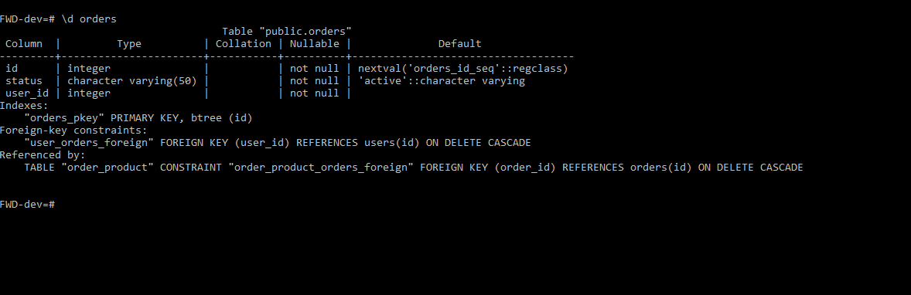
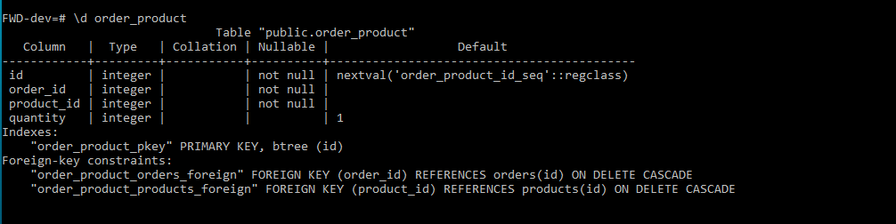
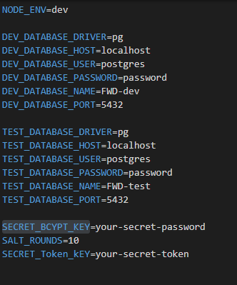

# FWD-project-2

---

## Features

- authentication with Jwt
- crud app users - product - orders

---

## Endpoints

- {app_url}/ => welcome message

### Users

- {app_url}/api/users/signup => create new user (post) Requirements [email,firstName,lastName,password]
- {app_url}/api/users/signin => login user (post) Requirements [email,password]
- {app_url}/api/users => get all users (get) [token required]
- {app_url}/api/users/:id => delete user (delete) [token required]
- {app_url}/api/users/:id => show one user (get) [token required]
- {app_url}/api/users/:id => update user (put) [token required]

  
  

### Products

- {app_url}/api/products => get all products (get) [token required]
- {app_url}/api/products => create new product (post) [token required]
- {app_url}/api/products/:id => delete product (delete) [token required]
- {app_url}/api/products/:id => show product (get) [token required]
- {app_url}/api/products/:id => update product (put) [token required]
- {app_url}/api/products/top?limit={insert intger value like 5} => update product (get) [token required]
- {app_url}/api/products/filter?category={kitchen} => get products by category (get) [token required]
- {app_url}/api/products => delete product (delete) [token required]

## Requirements

- create product [name: uniqe ,price: init, category: optinal ]



## Orders

- {app_url}/api/orders => create new orders (post) [token required]
- {app_url}/api/orders => update order (update) [token required]
- {app_url}/api/orders/:id => delete order (delete) [token required]

  

## Error Handling

- all point when data is invalid will return errors with status 422 or 401 if not user




---

## Usage

by

- first login in postgres with root user

```shell
     psql -U postgres -W
```

- create new user and database
- one for dev and another for test

```sql
    CREATE USER {your_user_name} WITH PASSWORD '{your_password}';
    CREATE DATABASE {your_database_name} WITH OWNER {your_user_name} ENCODING = 'utf8';
```




- users schema
  

- products schema

  

- order schema

  

- order_products schema

  

- copy .env.example to .env

  

## Available Scripts

- to initialize the app

```shell
    npm init
```

- to build the app

```shell
    npm run build
```

- to start development server

```shell
    npm run dev
```

- to test the app using dev db

```shell
    npm run test-dev
```

- to test the app using test db

```shell
    npm run test
```

- to reset database

```shell
    npm run reset
```

- to create database

```shell
    npm run create
```

- to migrate database

```shell
    npm run up
```

- to format code (typescript)

```shell
    npm run format
```

- to check code (typescript) errors

```shell
    npm run lint
```

- finall massage

```shell
   happy hack
```
